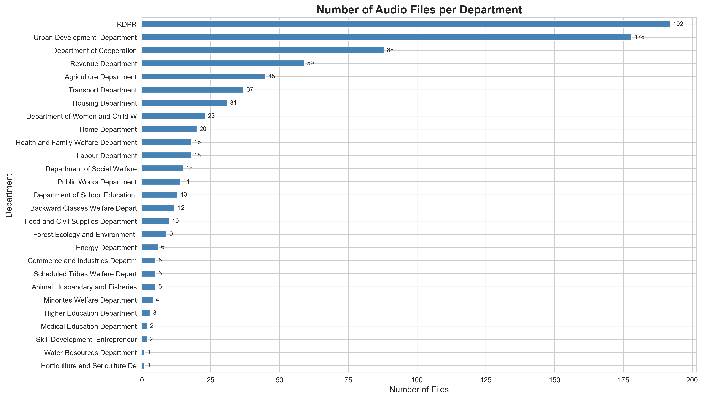
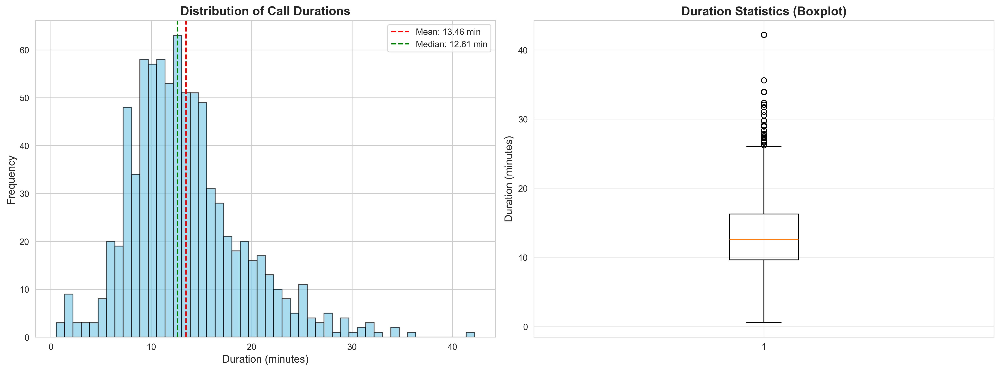
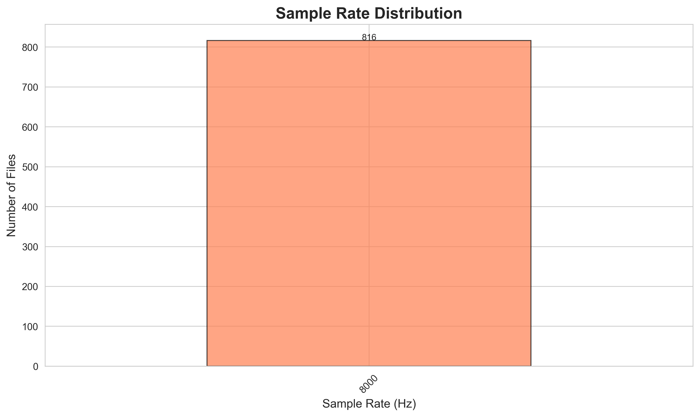
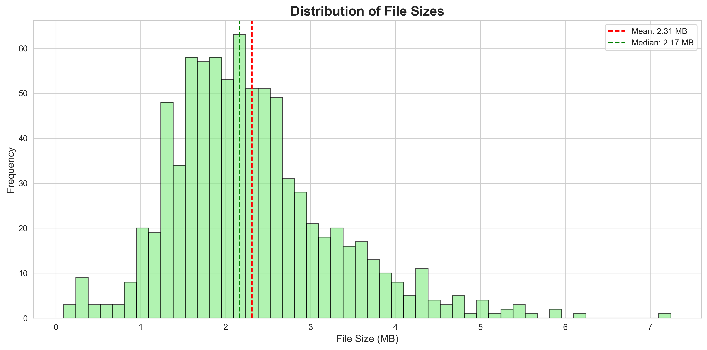
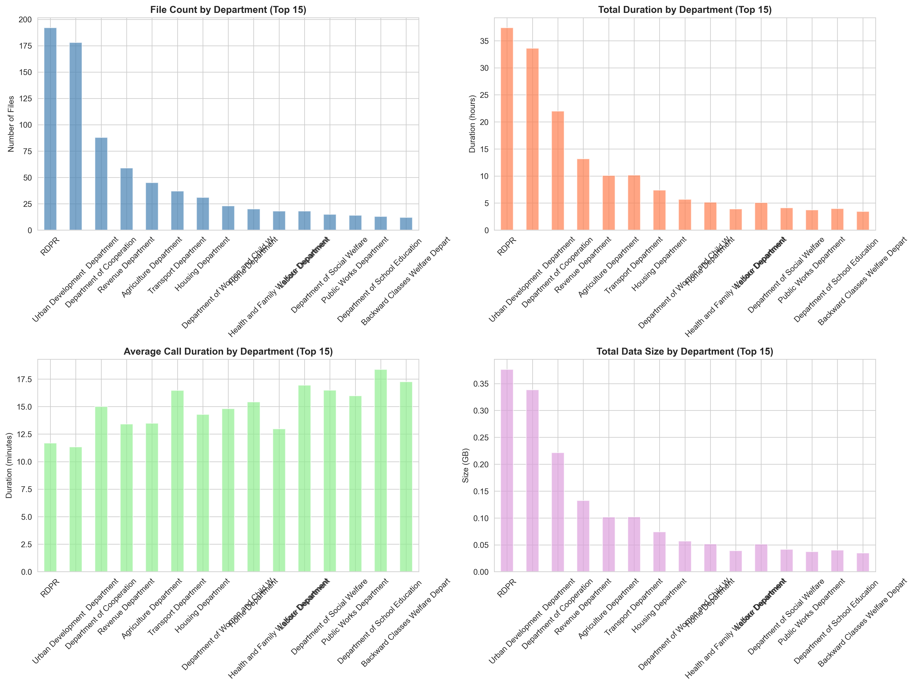
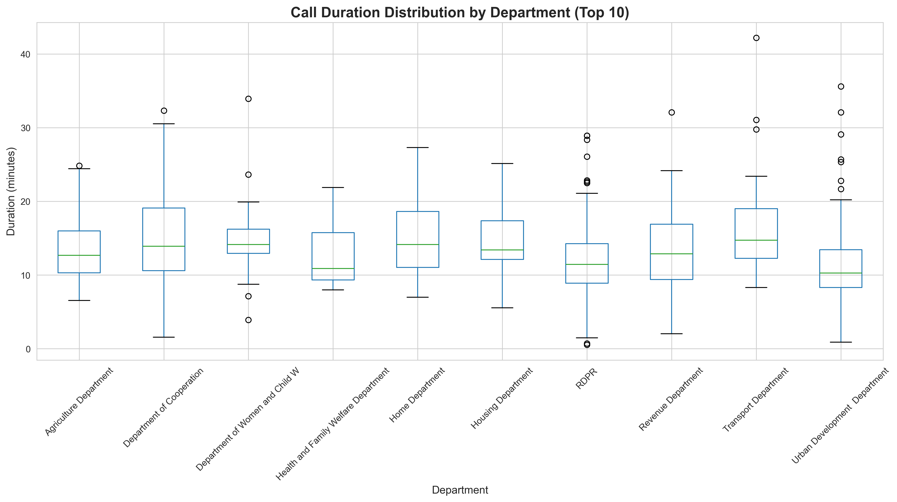

# Call Recording Analysis Report

**Generated:** 2026-01-24 14:55:29

---

## Executive Summary

- **Total Audio Files:** 816
- **Total Departments:** 27
- **Total Duration:** 183.01 hours (7.63 days)
- **Average Call Duration:** 807.41 seconds (13.46 minutes)
- **Median Call Duration:** 756.58 seconds
- **Total Data Size:** 1.84 GB
- **Most Common Sample Rate:** 8000 Hz

## Audio Quality Metrics

### Sample Rate Distribution

| Sample Rate (Hz) | Count |
|------------------|-------|
| 8000 | 816 |

### Channel Distribution

| Channels | Count |
|----------|-------|
| Mono | 816 |

## Department Statistics

### Complete Department Breakdown

| Department | Files | % of Total | Total Duration (hrs) | Avg Duration (min) | Total Size (MB) |
|------------|-------|------------|---------------------|-------------------|----------------|
| RDPR | 192.0 | 23.5% | 37.40 | 11.69 | 385.39 |
| Urban Development  Department | 178.0 | 21.8% | 33.63 | 11.33 | 346.47 |
| Department of Cooperation | 88.0 | 10.8% | 22.00 | 15.00 | 226.65 |
| Revenue Department | 59.0 | 7.2% | 13.18 | 13.41 | 135.83 |
| Agriculture Department | 45.0 | 5.5% | 10.11 | 13.48 | 104.14 |
| Transport Department | 37.0 | 4.5% | 10.15 | 16.46 | 104.58 |
| Housing Department | 31.0 | 3.8% | 7.38 | 14.28 | 76.01 |
| Department of Women and Child W | 23.0 | 2.8% | 5.68 | 14.80 | 58.47 |
| Home Department | 20.0 | 2.5% | 5.14 | 15.42 | 52.95 |
| Health and Family Welfare Department | 18.0 | 2.2% | 3.89 | 12.98 | 40.13 |
| Labour Department | 18.0 | 2.2% | 5.08 | 16.94 | 52.37 |
| Department of Social Welfare | 15.0 | 1.8% | 4.12 | 16.49 | 42.47 |
| Public Works Department | 14.0 | 1.7% | 3.73 | 15.98 | 38.43 |
| Department of School Education  | 13.0 | 1.6% | 3.98 | 18.37 | 41.01 |
| Backward Classes Welfare Depart | 12.0 | 1.5% | 3.45 | 17.25 | 35.53 |
| Food and Civil Supplies Department | 10.0 | 1.2% | 2.79 | 16.76 | 28.77 |
| Forest,Ecology and Environment  | 9.0 | 1.1% | 2.13 | 14.23 | 21.98 |
| Energy Department | 6.0 | 0.7% | 1.93 | 19.34 | 19.93 |
| Commerce and Industries Departm | 5.0 | 0.6% | 1.37 | 16.44 | 14.11 |
| Scheduled Tribes Welfare Depart | 5.0 | 0.6% | 1.19 | 14.25 | 12.23 |
| Animal Husbandary and Fisheries | 5.0 | 0.6% | 1.32 | 15.81 | 13.57 |
| Minorites Welfare Department | 4.0 | 0.5% | 0.88 | 13.24 | 9.09 |
| Higher Education Department | 3.0 | 0.4% | 0.87 | 17.32 | 8.92 |
| Medical Education Department | 2.0 | 0.2% | 0.42 | 12.72 | 4.37 |
| Skill Development, Entrepreneur | 2.0 | 0.2% | 0.35 | 10.45 | 3.59 |
| Water Resources Department | 1.0 | 0.1% | 0.42 | 25.07 | 4.30 |
| Horticulture and Sericulture De | 1.0 | 0.1% | 0.42 | 25.03 | 4.30 |

## Visualizations

### Files per Department

### Duration Distribution

### Sample Rate Distribution

### File Size Distribution

### Department Comparison

### Duration by Department

## Data Quality & Recommendations

### For ASR Training/Testing

✅ **Consistent Sample Rate:**
- All audio at 8000 Hz - Good for ASR training

⚠️ **Long Average Duration:**
- Long recordings may need segmentation
- Consider chunking for training

### Next Steps

1. **Transcription:**
   - Identify which departments have metadata/transcriptions
   - Consider using Whisper or similar for automatic transcription
   - Human verification recommended for quality

2. **Data Preprocessing:**
   - Normalize audio levels
   - Resample to consistent rate (16kHz recommended)
   - Convert to mono if stereo
   - Remove silence/noise if needed

3. **Dataset Preparation:**
   - Create train/val/test splits by department
   - Balance dataset if departments vary significantly
   - Create manifest files for NeMo or similar frameworks

4. **Quality Assessment:**
   - Manual review of sample recordings
   - Check for background noise, multiple speakers
   - Assess language/dialect consistency

## Spreadsheet Data

Found 27 spreadsheet files across departments.

### Spreadsheet Summary

| Department | Filename | Rows | Columns |
|------------|----------|------|----------|
| Department of Women and Child W | Untitled spreadsheet.xlsx | 24 | 22 |
| Water Resources Department | Untitled spreadsheet.xlsx | 1 | 22 |
| Revenue Department | Revene_CallCenter.xlsx | 96 | 20 |
| Transport Department | Untitled spreadsheet.xlsx | 41 | 22 |
| Food and Civil Supplies Department | Untitled spreadsheet.xlsx | 12 | 22 |
| RDPR | RDPR_CallCenter.xlsx | 209 | 21 |
| Housing Department | Untitled spreadsheet.xlsx | 39 | 22 |
| Minorites Welfare Department | Untitled spreadsheet.xlsx | 4 | 22 |
| Labour Department | Untitled spreadsheet.xlsx | 20 | 22 |
| Department of Social Welfare | Untitled spreadsheet.xlsx | 18 | 23 |
| Scheduled Tribes Welfare Depart | Untitled spreadsheet.xlsx | 5 | 23 |
| Health and Family Welfare Department | Untitled spreadsheet.xlsx | 21 | 22 |
| Commerce and Industries Departm | Untitled spreadsheet.xlsx | 6 | 22 |
| Department of Cooperation | Untitled spreadsheet.xlsx | 92 | 24 |
| Agriculture Department | Untitled spreadsheet.xlsx | 52 | 22 |
| Animal Husbandary and Fisheries | Untitled spreadsheet.xlsx | 5 | 22 |
| Home Department | Untitled spreadsheet.xlsx | 23 | 22 |
| Forest,Ecology and Environment  | Untitled spreadsheet.xlsx | 12 | 22 |
| Urban Development  Department | UDD_CallCenter.xlsx | 199 | 21 |
| Department of School Education  | Untitled spreadsheet.xlsx | 15 | 22 |
| Public Works Department | Untitled spreadsheet.xlsx | 15 | 23 |
| Backward Classes Welfare Depart | Untitled spreadsheet.xlsx | 12 | 22 |
| Higher Education Department | Untitled spreadsheet.xlsx | 3 | 22 |
| Skill Development, Entrepreneur | Untitled spreadsheet.xlsx | 2 | 22 |
| Energy Department | Untitled spreadsheet.xlsx | 8 | 22 |
| Medical Education Department | Untitled spreadsheet.xlsx | 2 | 22 |
| Horticulture and Sericulture De | Untitled spreadsheet.xlsx | 1 | 22 |

---

*Report generated automatically by audio_analysis pipeline*
